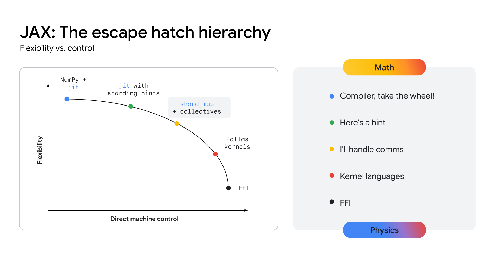

---
jupytext:
  formats: ipynb,md:myst
  text_representation:
    extension: .md
    format_name: myst
    format_version: 0.13
kernelspec:
  display_name: Python 3 (ipykernel)
  language: python
  name: python3
---

# Part 12: Pallas Kernels

```{code-cell} ipython3
# @title Setup { display-mode: "form" }

import jax
import jax.numpy as jnp
from jax.experimental import pallas as pl
import numpy as np

print(f"JAX version:     {jax.__version__}")
print(f"Devices:         {jax.devices()}")
print(f"Default backend: {jax.default_backend()}")
```

---

# 1. The XLA Compilation Pipeline

Before understanding *why* Pallas exists, we need to understand what happens when you write ordinary JAX code. Every `jax.numpy` operation you write passes through a sophisticated compilation pipeline before it ever touches hardware.

## 1.1 From Python to Hardware: The Four-Stage Pipeline

When you decorate a function with [`jax.jit`](https://jax.readthedocs.io/en/latest/_autosummary/jax.jit.html), JAX doesn't execute your Python code directly. Instead, it **traces** the function to build a computation graph, then hands that graph to the [XLA (Accelerated Linear Algebra)](https://openxla.org/xla) compiler for optimization and code generation.

```
Stage 1          Stage 2           Stage 3            Stage 4
Python code  →  jaxpr (trace)  →  HLO (optimize)  →  Hardware code
                                                       └→ TPU: VLIW packets
                                                       └→ GPU: PTX/SASS
                                                       └→ CPU: LLVM IR
```

| Stage | What happens | Key concept |
|---|---|---|
| **1. Tracing** | JAX runs your function with *tracer* objects instead of real data, recording every operation | The output is a `jaxpr` - a functional intermediate representation of your computation |
| **2. Lowering to HLO** | The `jaxpr` is converted into [StableHLO](https://openxla.org/stablehlo), XLA's high-level intermediate representation | Hardware-agnostic; a portable description of the math |
| **3. HLO Optimization** | XLA applies dozens of optimization passes: operation fusion, memory layout planning, buffer allocation, dead code elimination | This is where XLA earns its performance - it sees the *entire* computation graph at once |
| **4. Code Generation** | The optimized HLO is compiled to hardware-specific machine code | TPU: Very Long Instruction Word (VLIW) packets. GPU: PTX via LLVM. CPU: native instructions |

Let's make Stage 1 concrete by looking at what a traced computation actually looks like:

```{code-cell} ipython3
# A simple function: ReLU of a linear layer
def linear_relu(x, W, b):
    return jnp.maximum(x @ W + b, 0)

# jax.make_jaxpr traces the function WITHOUT executing it.
# It shows the jaxpr: the sequence of primitive operations JAX recorded.
x_shape = jax.ShapeDtypeStruct((4, 8), jnp.float32)
W_shape = jax.ShapeDtypeStruct((8, 16), jnp.float32)
b_shape = jax.ShapeDtypeStruct((16,), jnp.float32)

jaxpr = jax.make_jaxpr(linear_relu)(x_shape, W_shape, b_shape)
print("Traced computation graph (jaxpr):")
print(jaxpr)
print("\nThis jaxpr is what XLA receives. It contains 3 primitive ops:")
print("  1. dot_general  (matrix multiply: x @ W)")
print("  2. add          (add bias: ... + b)")
print("  3. max          (ReLU: max(..., 0))")
print("\nXLA's job is to optimize and fuse these into efficient hardware code.")
```

## 1.2 Operation Fusion: XLA's Most Important Optimization

The biggest single thing XLA does for performance is **operation fusion**: combining multiple operations into one hardware kernel so intermediate values never get written back to slow memory.

### 1.2.1 Without Fusion (Naïve Execution)

Each operation runs as a separate kernel. Each kernel reads its inputs from main memory (HBM), computes, and writes its output back to HBM:

```text
  HBM ──► ┌──────────────────┐ ──► HBM ──► ┌───────────────┐ ──► HBM ──► ┌─────────────────┐ ──► HBM
          │ Kernel 1: x @ W  │             │ Kernel 2: + b │             │ Kernel 3: max() │
          └──────────────────┘             └───────────────┘             └─────────────────┘
           read x, W                        read temp1, b                 read temp2
           write temp1                      write temp2                   write result

  Total HBM accesses: 6 reads + 3 writes = 9 memory operations
```

### 1.2.2 With Fusion (XLA)

XLA recognizes that these three operations form a chain and fuses them into a single kernel. Intermediate results stay in fast on-chip memory (registers or SRAM) and never touch HBM:

```text
  HBM ──► ┌─────────────────────────────────┐ ──► HBM
          │ Fused Kernel: max(x @ W + b, 0) │
          └─────────────────────────────────┘
           read x, W, b
           write result

  Total HBM accesses: 3 reads + 1 write = 4 memory operations
```

This matters because **memory bandwidth, not compute, is the bottleneck** for most ML operations. On a TPU7x (Ironwood) chip, the Matrix Multiply Unit (MXU) can perform 4,614 trillion operations per second, but HBM can only deliver 7.37 TB/s of data. Reducing memory traffic through fusion is often the difference between a kernel that achieves 10% of peak performance and one that achieves 80%.

### 1.2.3 XLA Fusion Categories

XLA classifies operations into categories and applies different fusion strategies:

| Category | Examples | Fusion behavior |
|---|---|---|
| **Element-wise** | `add`, `multiply`, `exp`, `relu` | Eagerly fused into chains - XLA handles these very well |
| **Reductions** | `sum`, `max`, `mean` | Fused with preceding element-wise ops (e.g., `sum(exp(x))`) |
| **Broadcasts** | Adding a bias `(M,N) + (N,)` | Fused with consuming operations |
| **Contractions** | `dot`, `conv` | Mapped to specialized hardware (MXU on TPU, Tensor Cores on GPU) |

## 1.3 Where XLA Falls Short

XLA's fusion heuristics are powerful but not omniscient. There are systematic gaps where its automatic optimization produces suboptimal code:

### 1.3.1 Multi-Step Reductions

Consider softmax: `exp(x - max(x)) / sum(exp(x - max(x)))`. This requires **two passes** over the data (one for `max`, one for `sum`), and XLA typically can't fuse them into a single pass because the second pass depends on the result of the first. Each pass means a full HBM round-trip.

### 1.3.2 Non-Standard Access Patterns

Novel attention mechanisms (sparse attention, sliding window, ring attention) require custom memory-access patterns that don't map to XLA's built-in primitives. XLA has no way to express "load only these specific non-contiguous elements" efficiently.

### 1.3.3 Hardware-Specific Features

Every accelerator has unique hardware features that XLA's generic optimization passes can't fully exploit:
- **TPU**: VMEM scratchpad management, scalar prefetch, SparseCore offloading

- **GPU**: Shared memory tiling, warp-level primitives, async copy

> **This is the gap Pallas fills.** When XLA's automatic optimizations aren't enough, Pallas lets you write the kernel yourself, taking manual control of tiling, memory management, and hardware-specific features.

+++

## 1.4 The Continuum of Abstraction

The JAX ecosystem provides a **spectrum of control** over how your code maps to hardware. Most code should live at the highest level of abstraction, where the compiler handles optimization. You drop down to lower levels only when profiling reveals opportunities the compiler can't exploit.



| Level | API | You control | Compiler controls | When to use |
|---|---|---|---|---|
| **Highest** | `jax.numpy` / Flax / Optax | What to compute | Everything else | 95% of code |
| **Mid** | `jax.lax` / `custom_vjp` | Op selection, custom gradients | Fusion, memory, hardware mapping | Custom primitives, gradient surgery |
| **Low** | **Pallas** | Tiling, memory movement, fusion | Backend compilation (Triton/Mosaic) | Performance-critical kernels |
| **Lowest** | Triton / Mosaic directly | Everything | Nothing | Hardware-specific expert optimization |

> **Rule of thumb**: Start with `jax.numpy`. Profile first. Only reach for Pallas when you've identified a specific bottleneck that XLA can't optimize.

+++

---

# 2. TPU Hardware: Inside the Ironwood Chip

You can't write efficient kernels without understanding the hardware your code runs on. XLA hides hardware details; Pallas exposes them. This section covers the architecture of Google's latest TPU generation, [Ironwood (TPU7x)](https://docs.cloud.google.com/tpu/docs/tpu7x), so you understand *why* Pallas kernels are structured the way they are.

## 2.1 The Ironwood Architecture


Each Ironwood chip contains **two chiplets**. Each chiplet is a self-contained compute unit with its own TensorCore, SparseCores, and 96 GB of HBM. The two chiplets are connected by a die-to-die (D2D) interface that is 6× faster than the inter-chip interconnect.

## 2.2 Inside a TensorCore: Three Compute Units

Each TensorCore contains three specialized processing units, each designed for a different type of computation:

| Unit | What it does | Operations | Key characteristics |
|---|---|---|---|
| **MXU** (Matrix Multiply Unit) | Dense matrix multiplication | `matmul`, `dot`, `conv` | 128×128 systolic array. Native `bfloat16` and FP8 support. Peak 4,614 TFLOPS (FP8) per chip. |
| **VPU** (Vector Processing Unit) | Element-wise and vector operations | `add`, `exp`, `max`, `relu`, `sum` | 2D SIMD processor. Handles activations, normalization, reductions. |
| **Scalar Unit** | Control flow and addressing | Loops, branches, memory address calculation | Manages prefetch scheduling and program flow. |

### 2.2.1 The MXU: A Systolic Array

The MXU is the computational powerhouse of the TPU. It's a **128×128 grid of arithmetic logic units (ALUs)** arranged as a [systolic array](https://en.wikipedia.org/wiki/Systolic_array). Data flows through the grid in a wave-like pattern: each ALU performs a multiply-accumulate and passes the result to its neighbor, without writing back to memory at each step. This design achieves extremely high throughput for matrix multiplications.

The key implication for Pallas: **any `jnp.dot` or matrix multiply inside your kernel compiles to MXU instructions**. To fully utilize the MXU, your tile dimensions should be multiples of 128.

### 2.2.2 The VPU: Everything Else

Operations that aren't matrix multiplications run on the VPU: element-wise math (`exp`, `log`, `relu`), reductions (`sum`, `max`), and normalization. The VPU is powerful but has significantly fewer peak FLOPS than the MXU. This means non-matmul operations can become bottlenecks in poorly designed kernels.

## 2.3 The Memory Hierarchy

Understanding the TPU's memory hierarchy is essential for writing performant Pallas kernels. The hierarchy has three tiers, each trading capacity for speed:

```
                       ┌──────────────────────────────────────┐
                       │         Host Memory (CPU)          │  960 GB per VM
                       │    Stores datasets, checkpoints     │  PCIe bandwidth (slowest)
                       └─────────────────┬────────────────────┘
                                         │ PCIe
                       ┌─────────────────┴────────────────────┐
                       │    HBM (High Bandwidth Memory)     │  192 GB per chip (96 GB/chiplet)
                       │    Stores weights, activations,     │  7.37 TB/s bandwidth
                       │    gradients, optimizer state       │
                       └─────────────────┬────────────────────┘
                                         │
                       ┌─────────────────┴────────────────────┐
                       │    VMEM (Vector Memory / SRAM)      │  ~64 MB (software-managed)
                       │    Pallas kernel scratchpad          │  Highest bandwidth (fastest)
                       │    Data must be here for compute     │
                       └─────────┬─────────┬──────────────────┘
                                 │         │
                            ┌────┴───┐ ┌──┴────┐
                            │  MXU   │ │  VPU  │  Compute units
                            │ 128x128│ │ SIMD  │
                            └────────┘ └───────┘
```

| Tier | Capacity | Bandwidth | Role in Pallas |
|---|---|---|---|
| **VMEM** (SRAM) | ~64 MB | Highest (direct to MXU/VPU) | The kernel's working memory. `Ref` data lives here during computation. |
| **HBM** | 192 GB per chip | 7.37 TB/s | Where your full arrays live. `BlockSpec` controls what gets loaded into VMEM. |
| **Host Memory** | 960 GB per VM | PCIe (slowest) | Used for data loading and checkpoint offloading. Not directly used by Pallas. |

> **The main constraint**: Data must move from HBM into VMEM before the MXU or VPU can touch it. Every HBM → VMEM transfer takes time. The entire point of Pallas kernel design is **minimizing these transfers** by keeping data in VMEM as long as possible and doing as much computation as possible per transfer.

### 2.3.1 VMEM: The Key Constraint

VMEM is the fast, on-chip SRAM that acts as a **software-managed scratchpad** for your Pallas kernels. Unlike CPU caches (which are hardware-managed), VMEM placement is controlled by the compiler and your kernel's block sizes.

The total VMEM on Ironwood is ~64 MB per TensorCore, but it's shared between:
- **Scoped VMEM**: Available for your kernel's tile data (the `Ref` contents)

- **Weight prefetch buffer**: Used by the compiler to overlap loading of the next tile with computation of the current one

When you define `block_shape=(128, 128)` for a `float32` array, that's `128 × 128 × 4 bytes = 64 KB` per Ref. If your kernel has 3 input Refs and 1 output Ref with this block shape, you need at least `4 × 64 KB = 256 KB` of VMEM just for tile data. Setting block shapes too large will exceed VMEM capacity and cause compilation failures.

## 2.4 Ironwood's Dual-Chiplet Architecture

Earlier TPU generations exposed each chip as a single device. Ironwood splits each chip into **two independent chiplets**:

| Property | Per Chiplet | Per Chip (2 chiplets) |
|---|---|---|
| TensorCores | 1 | 2 |
| SparseCores | 2 | 4 |
| HBM | 96 GB | 192 GB |
| JAX devices | 1 | 2 |

JAX exposes each Ironwood chip as **two separate devices** (one per chiplet). Inter-chiplet communication uses the D2D interface (6× faster than the inter-chip ICI network) and is managed via collective operations.

## 2.5 Scaling: The ICI Network

Ironwood chips are connected via a **3D torus interconnect** (Inter-Chip Interconnect, or ICI) with 200 GBps of bidirectional bandwidth per axis. Pods scale up to 9,216 chips. This network is what enables large-scale data and model parallelism (covered in [Notebook 10](10_sharding_and_multidevice.ipynb)).

> **For Pallas in this notebook**: We focus on the architecture *within* a single TensorCore (VMEM, MXU, VPU). Multi-chip parallelism is orthogonal: you shard across chips using standard JAX sharding, and each chip runs its Pallas kernels locally.

+++

---

# 3. Introduction to Pallas

## 3.1 What Is Pallas?

> **Important caveat before writing your first kernel**: Pallas kernels are **not automatically differentiable**. Standard JAX's `grad` cannot look inside a kernel. If you need gradients through a Pallas kernel (e.g., for a custom attention layer in training), you must write a second kernel for the backward pass and register it with [`jax.custom_vjp`](https://jax.readthedocs.io/en/latest/_autosummary/jax.custom_vjp.html). For inference-only kernels, this doesn't matter.

> **Pallas is a kernel language embedded in JAX that lets you write custom hardware kernels in Python.**

Instead of describing *what* to compute (as with `jax.numpy`), Pallas lets you describe *how* to compute it at the block level: which chunks of data to load from HBM into VMEM, what operations to perform on them, and where to store the results.

Pallas compiles to different backends depending on the hardware:
- **TPU**: Compiles via [Mosaic](https://jax.readthedocs.io/en/latest/pallas/tpu/index.html) to TPU machine code

- **GPU**: Compiles via [Triton](https://openai.com/research/triton) to GPU kernels (NVIDIA GPUs)

- **CPU**: Runs in `interpret` mode for debugging and prototyping

The key benefit is that you write your kernel **once** in Python, and Pallas handles the backend-specific compilation.

## 3.2 Where Pallas Fits in the Stack

```
  High-level:   jax.numpy / Flax / Optax       ← Most code lives here (XLA optimizes)
  Mid-level:    jax.lax / custom_vjp            ← Control flow, custom gradients
  Low-level:    Pallas (jax.experimental.pallas) ← Custom kernels (this notebook)
  Hardware:     Triton (GPU) / Mosaic (TPU)     ← Compiled output
```

## 3.3 When You Need Pallas

Based on what we learned about XLA's limitations in Section 1, there are three concrete scenarios:

| Scenario | Problem | Pallas solution |
|---|---|---|
| **Fused kernels** | XLA doesn't fuse multi-step reductions (e.g., softmax), causing extra HBM round-trips | Write a single kernel that does everything in one pass through VMEM |
| **Custom attention** | Novel attention patterns (sparse, sliding window) don't map to XLA's primitives | Implement the exact memory-access pattern you need, controlling which blocks load into VMEM |
| **Hardware-specific tricks** | XLA can't exploit all hardware features (e.g., TPU VMEM tuning, scalar prefetch) | Use Pallas with backend-specific APIs to directly manage memory hierarchy |

+++

---

# 4. The Pallas Programming Model

## 4.1 A Paradigm Shift

Pallas requires a fundamentally different way of thinking compared to standard JAX.

**Quick `Ref` reference:**

| Syntax | Meaning |
|---|---|
| `x_ref[:]` | Read the full contents of the input buffer into a local array |
| `x_ref[i:i+B]` | Read a slice of the input buffer |
| `out_ref[:] = value` | Write `value` into the entire output buffer |
| `out_ref[i] = value` | Write `value` into position `i` of the output buffer |

Reading gives you a regular JAX array you can compute with. Writing stores the result back to the hardware buffer.

Recall from [Notebook 01](01_jax_arrays_and_immutability.ipynb) that JAX enforces immutability: you never modify arrays in place. Pallas deliberately breaks this rule within the kernel boundary.

| | **Standard JAX** | **Pallas** |
|---|---|---|
| **Data model** | Immutable arrays (`jnp.ndarray`) | Mutable references (`Ref`) |
| **Programming style** | Functional: `y = f(x)` | Imperative: read from `Ref`, compute, write to `Ref` |
| **Scope** | Whole-array operations | Block-level operations (one tile at a time) |
| **Memory management** | Automatic (XLA decides) | Semi-manual (you define block shapes → VMEM usage) |
| **Return value** | Function returns result | Kernel writes result into output `Ref` |
| **Compilation** | XLA | Triton (GPU) / Mosaic (TPU) / interpret (CPU) |

## 4.2 The Three Key Abstractions

### 4.2.1 Kernel Functions and `Ref` Objects

A Pallas kernel is a Python function that takes [`Ref`](https://jax.readthedocs.io/en/latest/jax.experimental.pallas.html) objects as arguments. `Ref` objects are **mutable array references**: they represent a block of data that has been loaded from HBM into VMEM (on TPU) or registers (on GPU). You read from input `Ref`s and write to output `Ref`s:

```python
def my_kernel(x_ref, y_ref, out_ref):    # All args are Ref objects
    value = x_ref[...]                    # Read entire block from VMEM
    out_ref[...] = value + y_ref[...]     # Write result back to VMEM
```

The `[...]` syntax (Ellipsis) reads or writes the **entire contents** of a `Ref`. You can also use standard indexing like `x_ref[0]` or `x_ref[2:5]`.

### 4.2.2 `pallas_call`

[`pl.pallas_call`](https://jax.readthedocs.io/en/latest/jax.experimental.pallas.html) is the bridge between standard JAX and your kernel. It wraps a kernel function so it can be called with regular JAX arrays:

```python
result = pl.pallas_call(
    my_kernel,                # The kernel function
    out_shape=jax.ShapeDtypeStruct(shape, dtype),  # Shape/dtype of output
    interpret=True,           # Run on CPU for debugging
)(x, y)                       # Regular JAX arrays as inputs
```

`pallas_call` handles the conversion: regular JAX arrays go in, are presented to the kernel as `Ref` objects, and regular JAX arrays come out.

### 4.2.3 Grids and BlockSpecs

For large arrays, you don't process everything at once. Instead, you define a **grid** that divides the work into blocks, and **BlockSpecs** that map each grid position to a slice of the input/output arrays. We'll cover these in detail in Section 6.

+++

---

# 5. Hello World: Vector Addition

Let's start with the simplest possible Pallas kernel: adding two vectors element-by-element. This example processes the entire array in a single block (no grid), which is the simplest possible configuration.

```{code-cell} ipython3
# Step 1: Define the kernel function.
# Arguments are Ref objects, NOT regular JAX arrays.
# The kernel reads from input Refs and writes to the output Ref.
def add_kernel(x_ref, y_ref, out_ref):
    """Add two arrays element-wise."""
    # x_ref[...] reads the entire contents of the Ref as a JAX array.
    # out_ref[...] = ... writes the result back into the output Ref.
    out_ref[...] = x_ref[...] + y_ref[...]

# Step 2: Create input arrays (regular JAX arrays).
x = jnp.array([1.0, 2.0, 3.0, 4.0])
y = jnp.array([10.0, 20.0, 30.0, 40.0])

# Step 3: Call the kernel via pallas_call.
# - The kernel function is the first argument.
# - out_shape defines the shape and dtype of the output array.
# - interpret=True runs the kernel on CPU (for portability).
result = pl.pallas_call(
    add_kernel,
    out_shape=jax.ShapeDtypeStruct(x.shape, x.dtype),
    interpret=True,
)(x, y)

# Step 4: Verify against standard JAX.
expected = x + y
print(f"x:        {x}")
print(f"y:        {y}")
print(f"Pallas:   {result}")
print(f"Expected: {expected}")
print(f"Match:    {jnp.allclose(result, expected)}")
```

Let's break down what happened:

1. **`add_kernel`** is a regular Python function, but its arguments are `Ref` objects, not arrays. The `[...]` syntax reads/writes the full content of each `Ref`.

2. **`pl.pallas_call`** wraps the kernel so it accepts and returns regular JAX arrays. It handles the conversion between JAX arrays and `Ref` objects.

3. **`out_shape`** tells Pallas what shape and dtype to allocate for the output. It takes `jax.ShapeDtypeStruct(shape, dtype)`, a lightweight descriptor that carries only metadata, not data. Pallas allocates the actual buffer; the kernel fills it by writing to `out_ref`.

4. **`interpret=True`** runs the kernel in interpreter mode on CPU. On GPU or TPU, you would omit this flag and Pallas would compile to native hardware instructions.

> **Key insight**: The kernel doesn't *return* a value. It *writes* to the output `Ref`. This is fundamentally different from standard JAX, where functions return immutable arrays. In hardware terms, the kernel is writing into VMEM, and `pallas_call` copies the final VMEM contents back to HBM as the output array.

```{code-cell} ipython3
# Pallas kernels can write to multiple output Refs.
# Just declare multiple out_shape entries as a tuple.

def add_and_mul_kernel(x_ref, y_ref, sum_ref, prod_ref):
    """Compute both sum and product in a single kernel."""
    sum_ref[...] = x_ref[...] + y_ref[...]
    prod_ref[...] = x_ref[...] * y_ref[...]

x = jnp.array([1.0, 2.0, 3.0])
y = jnp.array([4.0, 5.0, 6.0])

out_shape = (
    jax.ShapeDtypeStruct(x.shape, x.dtype),  # for sum_ref
    jax.ShapeDtypeStruct(x.shape, x.dtype),  # for prod_ref
)

total, product = pl.pallas_call(
    add_and_mul_kernel,
    out_shape=out_shape,
    interpret=True,
)(x, y)

print(f"x:       {x}")
print(f"y:       {y}")
print(f"Sum:     {total}     (expected: {x + y})")
print(f"Product: {product}  (expected: {x * y})")
```

---

# 6. Grids and BlockSpecs

The kernels above process entire arrays in a single invocation. This works for small arrays but breaks down for large ones. Recall from Section 2 that VMEM on Ironwood is only ~64 MB: loading a 1 GB activation tensor all at once would far exceed this limit.

The solution is **tiling**: divide the array into smaller blocks, process one block at a time, and let the hardware pipeline the transfers.

> **The grid IS the tile coordinate system.** Each kernel invocation gets a unique position `(i, j, ...)` accessible via `pl.program_id(axis=0)`, `pl.program_id(axis=1)`, etc. The `index_map` in each `BlockSpec` uses these coordinates to compute which slice of the array to load. Think of it as: the grid tells you *where you are*, the `index_map` tells you *which tile to load*.

## 6.1 The Tiling Mental Model

> **`BlockSpec` in one sentence**: `block_shape` says *how big* each tile is; `index_map` says *which* tile to load for the current grid position. Together they tile the array: `block_shape` is the step size and `index_map` maps the current grid coordinate to a starting tile index.

Here's exactly what happens inside `pallas_call` when you specify a grid and BlockSpecs:

```
For each position in the grid:
  1. Evaluate each BlockSpec's index_map with the current grid indices
  2. Use the returned indices + block_shape to compute the array slice
  3. Load that slice from HBM into VMEM → this becomes the Ref
  4. Execute the kernel with those Refs
  5. Write output Ref contents from VMEM back to HBM at the corresponding position
```

## 6.2 Grids

A **grid** defines how many times the kernel executes. Each execution processes one block. Inside the kernel, [`pl.program_id(axis)`](https://jax.readthedocs.io/en/latest/jax.experimental.pallas.html) returns the current position along the specified grid axis.

```python
# A 1D grid with 4 positions: kernel runs 4 times
# pl.program_id(axis=0) returns 0, 1, 2, 3 across invocations
grid = (4,)
```

## 6.3 Anatomy of a BlockSpec

A [`BlockSpec`](https://jax.readthedocs.io/en/latest/jax.experimental.pallas.html) has two components that together tell Pallas which slice of an array to load for each grid position:

```python
pl.BlockSpec(
    block_shape=(128,),       # 1. How big is each block?
    index_map=lambda i: (i,)  # 2. Which block to load for grid position i?
)
```

### 6.3.1 How `index_map` Works, Precisely

The `index_map` is a function that takes **grid indices** and returns **block indices**. Each returned index is multiplied by the corresponding `block_shape` dimension to compute the actual starting position in the array.

```
Array position = index_map(grid_indices) * block_shape
```

For `block_shape=(128,)` and `index_map=lambda i: (i,)`:

| Grid position `i` | `index_map(i)` returns | Starting element | Slice loaded |
|---|---|---|---|
| 0 | `(0,)` | 0 × 128 = 0 | `array[0:128]` |
| 1 | `(1,)` | 1 × 128 = 128 | `array[128:256]` |
| 2 | `(2,)` | 2 × 128 = 256 | `array[256:384]` |
| 3 | `(3,)` | 3 × 128 = 384 | `array[384:512]` |

## 6.4 Visual Walkthrough: 1D Tiling

Consider a 512-element vector processed in blocks of 128:

```
Full array (512 elements, lives in HBM):
┌────────────────┬────────────────┬────────────────┬────────────────┐
│  elements 0-127  │  elements 128-255 │  elements 256-383 │  elements 384-511 │
└────────────────┴────────────────┴────────────────┴────────────────┘

Grid position i=0:          Grid position i=1:         Grid position i=2:         Grid position i=3:
HBM → Load [0:128] → VMEM   HBM → Load [128:256] → VMEM  HBM → Load [256:384] → VMEM  HBM → Load [384:512] → VMEM
Kernel sees x_ref[...]      Kernel sees x_ref[...]      Kernel sees x_ref[...]      Kernel sees x_ref[...]
  = 128 elements               = 128 elements              = 128 elements              = 128 elements
```

The kernel body is **identical** for every grid position: it always sees a `Ref` of shape `(128,)`. The grid and `BlockSpec` handle all the slicing automatically.

```{code-cell} ipython3
def add_kernel_blocked(x_ref, y_ref, out_ref):
    """Add two blocks element-wise.

    Thanks to BlockSpec, x_ref, y_ref, and out_ref each contain
    only one block of the full array (not the whole thing).
    """
    out_ref[...] = x_ref[...] + y_ref[...]

# Large vectors
n = 512
block_size = 128
n_blocks = n // block_size

x = jnp.arange(n, dtype=jnp.float32)
y = jnp.ones(n, dtype=jnp.float32) * 100

# The BlockSpec maps grid index i to array slice [i*block_size : (i+1)*block_size]
block_spec = pl.BlockSpec(block_shape=(block_size,), index_map=lambda i: (i,))

result = pl.pallas_call(
    add_kernel_blocked,
    out_shape=jax.ShapeDtypeStruct((n,), jnp.float32),
    grid=(n_blocks,),               # 4 blocks
    in_specs=[block_spec, block_spec],   # Same tiling for both inputs
    out_specs=block_spec,                # Same tiling for output
    interpret=True,
)(x, y)

expected = x + y
print(f"Array length:  {n}")
print(f"Block size:    {block_size}")
print(f"Grid size:     {n_blocks} blocks")
print(f"First 8:       {result[:8]}")
print(f"Last 8:        {result[-8:]}")
print(f"Match:         {jnp.allclose(result, expected)}")
```

Notice that the kernel function itself (`add_kernel_blocked`) is **identical** to our earlier `add_kernel`: all it does is `out_ref[...] = x_ref[...] + y_ref[...]`. The grid and BlockSpecs handle the slicing automatically. Inside the kernel, each `Ref` contains only one block's worth of data.

> **The mental model**: Think of the grid as a parallel `for` loop over tiles. Each iteration processes one tile. The `BlockSpec` tells Pallas which tile to load from HBM into VMEM for each iteration.

```{code-cell} ipython3
# @title Visualizing Grid Execution { display-mode: "form" }

# Demonstrate program_id by using it to write the block index
# into each element of the output.

def write_block_id_kernel(out_ref):
    """Write the current grid index into every element of the block."""
    block_id = pl.program_id(axis=0)
    # Fill the entire block with the block index value
    out_ref[...] = jnp.full(out_ref.shape, block_id, dtype=jnp.float32)

n = 16
block_size = 4

block_ids = pl.pallas_call(
    write_block_id_kernel,
    out_shape=jax.ShapeDtypeStruct((n,), jnp.float32),
    grid=(n // block_size,),
    out_specs=pl.BlockSpec(block_shape=(block_size,), index_map=lambda i: (i,)),
    interpret=True,
)()

print(f"Array:    {block_ids}")
print(f"\nBlock 0 (indices  0-3):  program_id = {int(block_ids[0])}")
print(f"Block 1 (indices  4-7):  program_id = {int(block_ids[4])}")
print(f"Block 2 (indices  8-11): program_id = {int(block_ids[8])}")
print(f"Block 3 (indices 12-15): program_id = {int(block_ids[12])}")
print("\nEach block was processed by a different grid invocation.")
```

## 6.5 How `in_specs` and `out_specs` Connect

Where the specs map to kernel arguments can be confusing. The rule is simple:

```python
result = pl.pallas_call(
    kernel_fn,           # kernel_fn(x_ref, y_ref, out_ref)
    ...
    in_specs=[           # in_specs[0] → x_ref
        spec_for_x,      # in_specs[1] → y_ref
        spec_for_y,
    ],
    out_specs=spec_for_out,  # out_specs → out_ref
)(x, y)                  # x → x_ref, y → y_ref
```

- `in_specs` is a list that matches **positionally** to the input arrays passed to the returned callable

- `out_specs` matches to the output `Ref`(s) in the kernel signature (which come after all input `Ref`s)

- Each spec can have a **different `block_shape` and `index_map`**: the inputs and outputs don't need to tile the same way

## 6.6 Non-Trivial Index Maps

The `index_map` doesn't have to be the identity function. Here's an example where each kernel invocation needs the **same input** (a shared bias vector) regardless of grid position, but tiles the main input and output normally:

```{code-cell} ipython3
def add_bias_kernel(x_ref, bias_ref, out_ref):
    """Add a shared bias to a tiled block of x."""
    out_ref[...] = x_ref[...] + bias_ref[...]

n = 512
block_size = 128

x = jnp.arange(n, dtype=jnp.float32)
bias = jnp.ones(block_size, dtype=jnp.float32) * 1000  # shared across all blocks

result = pl.pallas_call(
    add_bias_kernel,
    out_shape=jax.ShapeDtypeStruct((n,), jnp.float32),
    grid=(n // block_size,),
    in_specs=[
        pl.BlockSpec(block_shape=(block_size,), index_map=lambda i: (i,)),  # x: tiled normally
        pl.BlockSpec(block_shape=(block_size,), index_map=lambda i: (0,)),  # bias: always block 0
    ],
    out_specs=pl.BlockSpec(block_shape=(block_size,), index_map=lambda i: (i,)),
    interpret=True,
)(x, bias)

print(f"bias is always loaded from position 0, regardless of grid index.")
print(f"First 4:  {result[:4]}   (0+1000, 1+1000, 2+1000, 3+1000)")
print(f"At [128]: {result[128]}  (128+1000)")
print(f"At [384]: {result[384]}  (384+1000)")
print(f"Match:    {jnp.allclose(result[:block_size], x[:block_size] + bias)}")
```

The key line is `index_map=lambda i: (0,)` for the bias: regardless of which grid position `i` we're at, we always load block 0 of the bias array. This is how you handle **broadcast-like** behavior in Pallas: the grid iterates over tiles, but some inputs reference the same tile every time.

## 6.7 Visual Walkthrough: 2D BlockSpec

For a matrix with shape `(M, N)`, a 2D grid tiles both rows and columns:

```
Matrix (256 x 256), block_shape = (64, 64)
Grid = (4, 4) = 16 kernel invocations

       col=0      col=1      col=2      col=3
     ┌────────┬────────┬────────┬────────┐
r=0  │ (0,0)  │ (0,1)  │ (0,2)  │ (0,3)  │  index_map(i=0,j=0) → (0,0)
     ├────────┼────────┼────────┼────────┤  index_map(i=0,j=1) → (0,1)
r=1  │ (1,0)  │ (1,1)  │ (1,2)  │ (1,3)  │  ...
     ├────────┼────────┼────────┼────────┤  index_map(i=1,j=2) → (1,2)
r=2  │ (2,0)  │ (2,1)  │ (2,2)  │ (2,3)  │    = rows [128:192], cols [128:192]
     ├────────┼────────┼────────┼────────┤
r=3  │ (3,0)  │ (3,1)  │ (3,2)  │ (3,3)  │
     └────────┴────────┴────────┴────────┘

Each cell is a 64x64 tile loaded into the kernel's Ref.
The index_map=lambda i, j: (i, j) maps grid position (i,j) to block (i,j).
```

+++

---

# 7. 2D Grids: Matrix Operations

Grids can be multi-dimensional. For matrix operations, a 2D grid is natural: one axis iterates over rows of blocks, the other over columns of blocks.

```{code-cell} ipython3
def fused_mul_relu_kernel(x_ref, y_ref, out_ref):
    """Element-wise multiply followed by ReLU, fused into one kernel.

    In standard JAX, this would be two separate operations:
        z = x * y
        out = jnp.maximum(z, 0)

    Fusing them avoids writing the intermediate z to HBM.
    The intermediate z stays in VMEM throughout.
    """
    z = x_ref[...] * y_ref[...]
    out_ref[...] = jnp.maximum(z, 0)

# Matrix dimensions
M, N = 256, 256
block_m, block_n = 64, 64

key = jax.random.key(42)
k1, k2 = jax.random.split(key)
x = jax.random.normal(k1, (M, N))
y = jax.random.normal(k2, (M, N))

# 2D BlockSpec: index_map takes two arguments (row_block, col_block)
block_spec_2d = pl.BlockSpec(
    block_shape=(block_m, block_n),
    index_map=lambda i, j: (i, j)
)

result = pl.pallas_call(
    fused_mul_relu_kernel,
    out_shape=jax.ShapeDtypeStruct((M, N), jnp.float32),
    grid=(M // block_m, N // block_n),       # 4x4 grid of blocks
    in_specs=[block_spec_2d, block_spec_2d],
    out_specs=block_spec_2d,
    interpret=True,
)(x, y)

expected = jnp.maximum(x * y, 0)
print(f"Matrix shape:   {M} x {N}")
print(f"Block shape:    {block_m} x {block_n}")
print(f"Grid:           {M // block_m} x {N // block_n} = {(M // block_m) * (N // block_n)} blocks")
print(f"Output shape:   {result.shape}")
print(f"Match:          {jnp.allclose(result, expected)}")
print(f"\nNon-zero elements: {int(jnp.sum(result > 0))} / {M * N}")
print(f"(~50% expected for product of two normal distributions after ReLU)")
```

## 7.1 Why Fusion Matters

Let's connect this back to the hardware from Section 2. In the fused multiply-ReLU kernel above, here's what happens *without* and *with* fusion:

**Without fusion** (two separate XLA kernels):
```
Kernel 1: HBM → load x,y → VMEM → VPU computes x*y → VMEM → write z to HBM
Kernel 2: HBM → load z    → VMEM → VPU computes max(z,0) → VMEM → write result to HBM
```

**With fusion** (single Pallas kernel):
```
Kernel:   HBM → load x,y → VMEM → VPU computes max(x*y, 0) → VMEM → write result to HBM
```

The intermediate `z` never leaves VMEM. On Ironwood, this avoids a round-trip through the 7.37 TB/s HBM bus, which, despite being fast, is orders of magnitude slower than the VMEM-to-VPU path.

> **Note**: XLA often fuses simple element-wise chains like this automatically. Pallas becomes valuable for *complex* fusion patterns (like the softmax kernel in Section 10) where XLA's heuristic fusion doesn't cover the full computation.

+++

---

# 8. Reductions in Pallas

Reductions (sum, max, mean) are common operations that require special handling in a block-based model. The simplest approach is to process entire rows or columns in a single block, performing the reduction within the kernel.

```{code-cell} ipython3
def row_sum_kernel(x_ref, out_ref):
    """Compute the sum of each row.

    x_ref has shape (1, N) - one full row at a time.
    out_ref has shape (1,) - scalar output for this row.
    """
    row = x_ref[...]
    out_ref[0] = jnp.sum(row)

M, N = 8, 16
key = jax.random.key(0)
x = jax.random.normal(key, (M, N))

row_sums = pl.pallas_call(
    row_sum_kernel,
    out_shape=jax.ShapeDtypeStruct((M,), jnp.float32),
    grid=(M,),
    in_specs=[pl.BlockSpec(block_shape=(1, N), index_map=lambda i: (i, 0))],
    out_specs=pl.BlockSpec(block_shape=(1,), index_map=lambda i: (i,)),
    interpret=True,
)(x)

expected = jnp.sum(x, axis=1)
print(f"Matrix shape:  {x.shape}")
print(f"Row sums:      {row_sums}")
print(f"Expected:      {expected}")
print(f"Match:         {jnp.allclose(row_sums, expected, atol=1e-5)}")
```

```{code-cell} ipython3
def row_max_kernel(x_ref, max_ref, argmax_ref):
    """Find the maximum value and its index in each row."""
    row = x_ref[...]
    # Squeeze out the leading dimension of size 1 for reduction
    row_squeezed = jnp.squeeze(row, axis=0)
    max_ref[0] = jnp.max(row_squeezed)
    argmax_ref[0] = jnp.argmax(row_squeezed).astype(jnp.float32)

M, N = 6, 10
key = jax.random.key(7)
x = jax.random.normal(key, (M, N))

row_maxes, row_argmaxes = pl.pallas_call(
    row_max_kernel,
    out_shape=(
        jax.ShapeDtypeStruct((M,), jnp.float32),
        jax.ShapeDtypeStruct((M,), jnp.float32),
    ),
    grid=(M,),
    in_specs=[pl.BlockSpec(block_shape=(1, N), index_map=lambda i: (i, 0))],
    out_specs=(
        pl.BlockSpec(block_shape=(1,), index_map=lambda i: (i,)),
        pl.BlockSpec(block_shape=(1,), index_map=lambda i: (i,)),
    ),
    interpret=True,
)(x)

expected_max = jnp.max(x, axis=1)
expected_argmax = jnp.argmax(x, axis=1).astype(jnp.float32)
print(f"Matrix shape:  {x.shape}")
print(f"Row maxes:     {row_maxes}")
print(f"Expected:      {expected_max}")
print(f"Max match:     {jnp.allclose(row_maxes, expected_max, atol=1e-5)}")
print(f"\nRow argmaxes:  {row_argmaxes.astype(jnp.int32)}")
print(f"Expected:      {expected_argmax.astype(jnp.int32)}")
print(f"Argmax match:  {jnp.allclose(row_argmaxes, expected_argmax)}")
```

## 8.1 The Pattern for Reductions

The general pattern for row-wise reductions in Pallas:

1. **Grid**: One position per row → `grid=(M,)`

2. **Input BlockSpec**: Load the full row → `block_shape=(1, N)`

3. **Output BlockSpec**: Produce one scalar per row → `block_shape=(1,)`

4. **Kernel**: Use `jnp.sum`, `jnp.max`, etc. within each row

Column-wise reductions follow the same pattern with transposed block shapes: grid over columns, load a full column per block.

In hardware terms, each kernel invocation loads one row into VMEM, the VPU performs the reduction entirely in VMEM, and only the scalar result is written back to HBM.

+++

---

# 9. Mapping Pallas to TPU Hardware

Now let's connect the Pallas abstractions back to the Ironwood hardware from Section 2. Understanding this mapping is what makes the difference between a kernel that works and a kernel that's fast.

## 9.1 Which Compute Unit Handles What?

Every operation inside your Pallas kernel compiles to instructions on a specific compute unit:

| Pallas operation | Hardware unit | Example |
|---|---|---|
| `jnp.dot`, `x_ref[...] @ W_ref[...]` | **MXU** (systolic array) | Matrix multiplication in attention or MLP |
| `jnp.exp`, `jnp.maximum`, `+`, `*` | **VPU** (vector unit) | Activations, element-wise math |
| `jnp.sum`, `jnp.max` (reductions) | **VPU** | Row-wise softmax normalization |
| `pl.program_id(axis)` | **Scalar unit** | Grid iteration, address computation |
| `x_ref[...]` (load), `out_ref[...] = ...` (store) | **DMA engine** | HBM ↔ VMEM data transfer |

## 9.2 VMEM: The Kernel's Working Memory

When your kernel runs, all `Ref` data lives in VMEM. The block shapes you choose directly control VMEM consumption:

```python
# Example: How much VMEM does this kernel use?
# block_shape = (128, 128), dtype = float32 (4 bytes per element)
# Memory per Ref = 128 * 128 * 4 = 64 KB
#
# Kernel with 2 input Refs + 1 output Ref:
#   Total = 3 * 64 KB = 192 KB
#
# For bfloat16 (2 bytes per element):
#   Memory per Ref = 128 * 128 * 2 = 32 KB
#   Total = 3 * 32 KB = 96 KB  (half the VMEM!)
```

This is why `bfloat16` is so valuable: it halves your VMEM footprint, letting you use larger block sizes (which amortize DMA transfer overhead) or fit more Refs simultaneously.

## 9.3 The Roofline Model: Compute-Bound vs. Memory-Bound

Every kernel is limited by one of two bottlenecks:

1. **Compute-bound**: The MXU or VPU can't compute fast enough. More FLOPS would help, but you're already saturating bandwidth.

2. **Memory-bound**: The MXU/VPU are idle, waiting for data from HBM. More bandwidth or fewer transfers would help.

The **arithmetic intensity** (FLOPS per byte transferred) determines which regime you're in:

```
Arithmetic Intensity = Total FLOPs / Bytes transferred from HBM
```

| Metric | Ironwood (TPU7x, BF16) |
|---|---|
| Peak compute | ~2,307 TFLOPS (BF16) |
| HBM bandwidth | 7.37 TB/s |
| **Crossover point** | ~313 FLOPS/byte |

If your kernel's arithmetic intensity is **below** the crossover point, it's memory-bound: the MXU sits idle waiting for data. This is where fusion (keeping data in VMEM) has the biggest impact.

- **Matrix multiplications** typically have high arithmetic intensity (compute-bound) → benefit from larger tile sizes and MXU alignment

- **Element-wise operations** have low arithmetic intensity (memory-bound) → benefit from fusion to reduce HBM traffic

- **Softmax** is memory-bound → fusing the entire operation into one kernel (as we do in Section 10) is the primary optimization

## 9.4 Practical Guidelines for Ironwood

| Guideline | Rationale |
|---|---|
| Use `bfloat16` for MXU operations when possible | 2× throughput over `float32`, half the VMEM and HBM footprint |
| Align block dimensions to multiples of **128** | Matches the MXU's 128×128 systolic array for full utilization |
| Keep total block memory within VMEM budget (~64 MB) | Too-large blocks cause compilation failures |
| Fuse memory-bound operation chains into single kernels | Eliminates HBM round-trips for intermediates |
| Profile with [XProf](https://openxla.org/xprof) before hand-optimizing | Identify the actual bottleneck before changing code |

+++

---

# 10. Example: Softmax Kernel

## 10.1 Why Softmax Benefits from Fusion

Softmax is computed row-by-row:

$$\text{softmax}(x_i) = \frac{e^{x_i - \max(x)}}{\sum_j e^{x_j - \max(x)}}$$

In standard JAX, this requires multiple passes over the data. Each pass reads from and writes to HBM:

```python
m = jnp.max(x, axis=-1, keepdims=True)       # Pass 1: read row from HBM, write max to HBM
shifted = x - m                                # Pass 2: read row + max from HBM, write shifted to HBM
exps = jnp.exp(shifted)                        # Pass 3: read shifted from HBM, write exps to HBM
total = jnp.sum(exps, axis=-1, keepdims=True)  # Pass 4: read exps from HBM, write sum to HBM
result = exps / total                           # Pass 5: read exps + sum from HBM, write result to HBM
```

A fused kernel loads each row into VMEM **once**, performs all five steps using the VPU while data stays in VMEM, and writes the final result back to HBM **once**. This reduces HBM accesses from ~10 to just 2 (one read + one write).

```{code-cell} ipython3
def softmax_kernel(x_ref, out_ref):
    """Compute softmax over the last axis of a single row.

    All five steps happen in-kernel without writing intermediates
    back to HBM. Data stays in VMEM throughout.

    x_ref:   shape (1, N) - one row of the input matrix
    out_ref: shape (1, N) - one row of the output matrix
    """
    row = x_ref[...]

    # Step 1: Subtract max for numerical stability (VPU: reduction + broadcast)
    row_max = jnp.max(row, axis=1, keepdims=True)
    shifted = row - row_max

    # Step 2: Exponentiate (VPU: element-wise)
    exps = jnp.exp(shifted)

    # Step 3: Normalize (VPU: reduction + element-wise divide)
    total = jnp.sum(exps, axis=1, keepdims=True)
    out_ref[...] = exps / total
```

```{code-cell} ipython3
# @title Running the Fused Softmax { display-mode: "form" }

M, N = 32, 64  # 32 rows, each of length 64

key = jax.random.key(42)
x = jax.random.normal(key, (M, N))

result = pl.pallas_call(
    softmax_kernel,
    out_shape=jax.ShapeDtypeStruct((M, N), jnp.float32),
    grid=(M,),   # One grid position per row
    in_specs=[pl.BlockSpec(block_shape=(1, N), index_map=lambda i: (i, 0))],
    out_specs=pl.BlockSpec(block_shape=(1, N), index_map=lambda i: (i, 0)),
    interpret=True,
)(x)

# Verify against JAX's built-in softmax
expected = jax.nn.softmax(x, axis=-1)

print(f"Input shape:   {x.shape}")
print(f"Output shape:  {result.shape}")
print(f"Match:         {jnp.allclose(result, expected, atol=1e-5)}")
print(f"\n--- Correctness checks ---")
print(f"All values >= 0:   {bool(jnp.all(result >= 0))}")
print(f"All values <= 1:   {bool(jnp.all(result <= 1))}")
print(f"Rows sum to 1:     {jnp.allclose(jnp.sum(result, axis=1), 1.0, atol=1e-5)}")
print(f"\n--- Sample output (row 0, first 8 values) ---")
print(f"Pallas:   {result[0, :8]}")
print(f"Expected: {expected[0, :8]}")
```

## 10.2 What the Kernel Does: A Hardware View

Let's trace through the execution for a single row, connecting each step to the hardware:

| Step | Operation | Hardware unit | Memory | Standard JAX (unfused) |
|---|---|---|---|---|
| 0 | Load row | DMA engine | HBM → VMEM | HBM → VMEM |
| 1 | Find max | VPU (reduction) | Stays in VMEM | Write max to HBM, read row again |
| 2 | Subtract max | VPU (element-wise) | Stays in VMEM | Write shifted to HBM |
| 3 | Exponentiate | VPU (element-wise) | Stays in VMEM | Write exps to HBM |
| 4 | Sum | VPU (reduction) | Stays in VMEM | Write sum to HBM, read exps again |
| 5 | Divide | VPU (element-wise) | Stays in VMEM | Read exps + sum from HBM |
| 6 | Store result | DMA engine | VMEM → HBM | VMEM → HBM |
| | **HBM accesses** | | **1 read + 1 write** | **~10 reads/writes** |

> **This is the core value of Pallas**: expressing an entire multi-step computation as a single kernel that keeps data in VMEM, avoiding the overhead of materializing intermediate results in HBM. For memory-bound operations like softmax on real hardware, this fusion can deliver significant speedups.

```{code-cell} ipython3
# @title Fused Softmax with Larger Matrices { display-mode: "form" }

# Scale up to demonstrate the pattern works for realistic sizes.

for shape in [(64, 128), (128, 256), (256, 512)]:
    M, N = shape
    key = jax.random.key(M + N)
    x = jax.random.normal(key, (M, N))

    result = pl.pallas_call(
        softmax_kernel,
        out_shape=jax.ShapeDtypeStruct((M, N), jnp.float32),
        grid=(M,),
        in_specs=[pl.BlockSpec(block_shape=(1, N), index_map=lambda i: (i, 0))],
        out_specs=pl.BlockSpec(block_shape=(1, N), index_map=lambda i: (i, 0)),
        interpret=True,
    )(x)

    expected = jax.nn.softmax(x, axis=-1)
    match = jnp.allclose(result, expected, atol=1e-5)
    rows_ok = jnp.allclose(jnp.sum(result, axis=1), 1.0, atol=1e-5)
    print(f"Shape {M:>4}x{N:<4}  match={match}  rows_sum_to_1={rows_ok}")

print("\nFused softmax kernel works correctly at all tested sizes.")
```

---

# 11. Summary

## Core Series Complete

You've reached the end of the JAX Tutorial Series core curriculum. Here's what you covered:

| Notebook | Core Concept |
|---|---|
| 01 | Arrays, immutability, pure functions |
| 02 | Explicit PRNG, broadcasting |
| 03 | `jax.grad` - automatic differentiation |
| 04 | `jax.jit`, `jax.vmap` - compilation and vectorization |
| 05 | Pytrees - JAX's universal parameter container |
| 06 | Structured control flow under JIT (`lax.scan`, `lax.cond`) |
| 07 | Training from scratch - the raw JAX loop |
| 08 | Flax - `nn.Module`, `init`/`apply` |
| 09 | Optax - functional optimizers |
| 10 | Sharding - multi-device data and tensor parallelism |
| 11 | Profiling - benchmarking, buffer donation, precision |
| 12 | Pallas - custom hardware kernels |

There's also an optional **[Notebook 13: Capstone - LLM Inference](13_inference_patterns.ipynb)**: low-level patterns for shipping JAX models: int8 quantization, static-shape bucketing, KV-cache, AOT compilation, and a profiling workflow.

## Key Takeaways (this notebook)

- **XLA fusion has limits**: the XLA compiler automatically fuses operations to keep data in fast on-chip memory (VMEM). However, complex multi-step operations can cause intermediate memory explosions.

- **Pallas provides an escape hatch**: when XLA falls short, Pallas allows you to write custom hardware kernels using an imperative programming model.

- **VMEM management is manual**: you load tiles of data from slow HBM into fast VMEM using `BlockSpec`, mutate the data using `Ref` objects, and write it back.

- **Kernel fusion is the goal**: by keeping data in VMEM across multiple mathematical steps (like a full softmax), you avoid the massive bandwidth cost of writing intermediate results back to HBM.

## Where to Go From Here

- **[JAX documentation](https://jax.readthedocs.io/)**: reference for all APIs covered in this series

- **[Flax documentation](https://flax.readthedocs.io/)**: advanced Module patterns, NNX

- **[Optax documentation](https://optax.readthedocs.io/)**: learning rate schedules, gradient transformations

- **[Pallas documentation](https://docs.jax.dev/en/latest/pallas/)**: TPU and GPU kernel authoring

- **[MaxText](https://github.com/AI-Hypercomputer/maxtext)**: a reference LLM implementation using everything from this series at scale

+++

---

# 12. Exercises

Test your understanding with these challenges:

1. **Vector scaling kernel**: Write a Pallas kernel that multiplies every element of a vector by a scalar (passed as a second input array of shape `(1,)`). Use a grid and `BlockSpec` to process the vector in blocks of 64.

2. **Element-wise maximum**: Write a kernel that computes `jnp.maximum(x, y)` for two matrices using a 2D grid. Verify your result matches `jnp.maximum`.

3. **Row-wise mean and variance**: Extend the row-wise reduction pattern from Section 8 to compute both the mean and variance of each row. Return them as two separate outputs. Verify against `jnp.mean` and `jnp.var`.

4. **Fused GELU kernel**: Implement a fused GELU activation. The GELU formula is approximately `x * 0.5 * (1 + tanh(sqrt(2/π) * (x + 0.044715 * x³)))`. Write this as a single Pallas kernel using a 1D grid and verify against `jax.nn.gelu`.

5. **VMEM budget calculation**: For the fused softmax kernel in Section 10 with `N=4096` and `dtype=float32`, calculate the total VMEM consumed per kernel invocation (input Ref + output Ref). How does using `bfloat16` change the calculation? At what `N` would a single row exceed 1 MB of VMEM?
